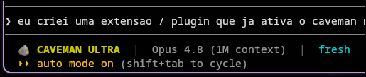

# 🪨 Caveman Ultra para Claude Code

Extensão para o [Claude Code](https://claude.com/claude-code) que:

1. **Ativa o modo caveman ultra automaticamente** em todo chat novo — sem você pedir.
   As respostas saem ultra-comprimidas (≈75% menos tokens), mantendo 100% da precisão
   técnica (nomes de arquivo, comandos, código e valores literais ficam exatos).
2. **Mostra uma statusline** embaixo do chat com: `🪨 CAVEMAN ULTRA`, o modelo em uso,
   e a pasta que o Claude está enxergando agora.



## Partes

| Arquivo | O que é |
|---------|---------|
| `skills/caveman/` | A skill `caveman` (6 níveis: lite → ultra + wenyan). O motor da compressão. |
| `statusline-caveman.sh` | Script da statusline (usa `jq` para ler modelo + pasta do JSON de sessão). |
| `caveman-ultra.md` | Bloco injetado na sua `~/.claude/CLAUDE.md` que força ativação automática. |
| `install.sh` / `uninstall.sh` | Instala / remove tudo. Idempotente. |

## Requisitos

- Claude Code
- `jq` (`sudo pacman -S jq` / `sudo apt install jq` / `brew install jq`)
- `bash`

## Instalar

```bash
git clone https://github.com/Gildaciolopes/claude-caveman-ultra.git
cd claude-caveman-ultra
./install.sh
```

Reinicie o Claude Code. Pronto — todo chat novo já abre em caveman ultra e a statusline aparece.

O instalador é **idempotente** e **não-destrutivo**:
- copia a skill para `~/.claude/skills/caveman`
- copia o script e liga `statusLine` no `~/.claude/settings.json` (via `jq`, preservando o resto)
- injeta o bloco de ativação na `~/.claude/CLAUDE.md` entre marcadores
  `<!-- BEGIN CAVEMAN ULTRA -->` / `<!-- END CAVEMAN ULTRA -->` (rodar de novo só substitui o bloco, não duplica)

## Usar em outro PC

Mesmo `git clone` + `./install.sh` em qualquer máquina com Claude Code.

## Controlar o nível durante uma sessão

```
/caveman lite      # compressão leve
/caveman full      # padrão
/caveman ultra     # compressão máxima (o default deste pacote)
stop caveman       # volta ao normal nesta sessão
```

## Remover

```bash
./uninstall.sh
```

Remove a skill, o script e a linha `statusLine`, e apaga só o bloco marcado da sua
`CLAUDE.md`. O resto da sua config fica intacto.

## Licença

MIT.
